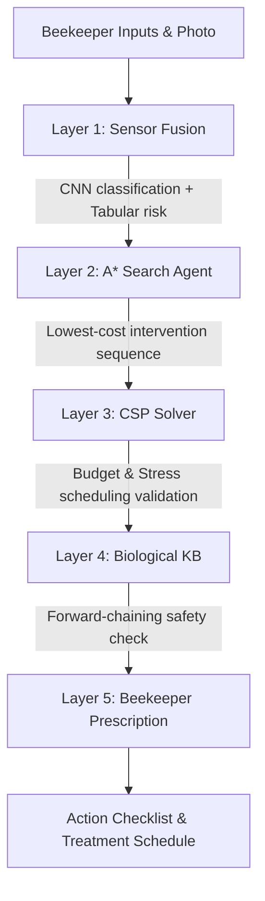
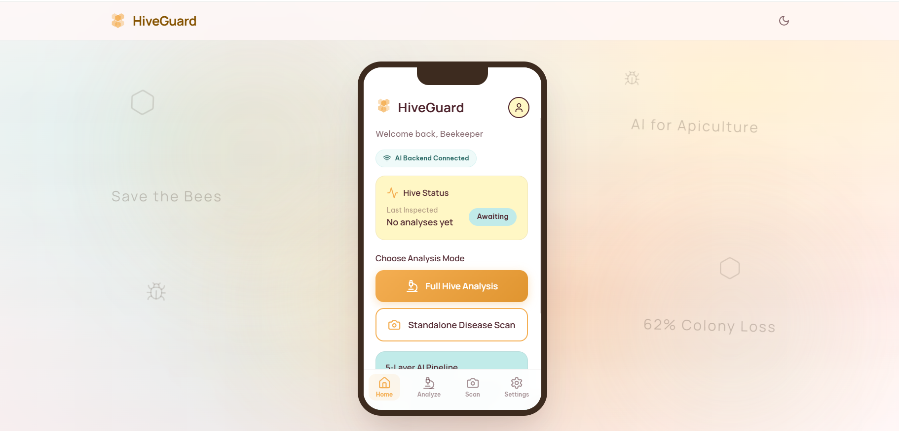
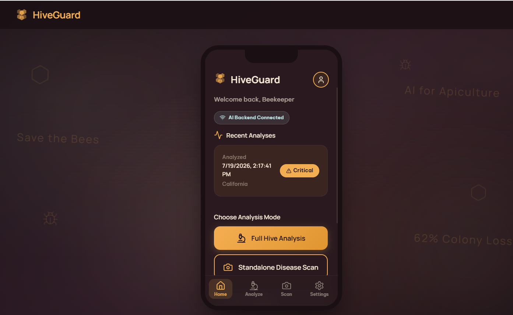
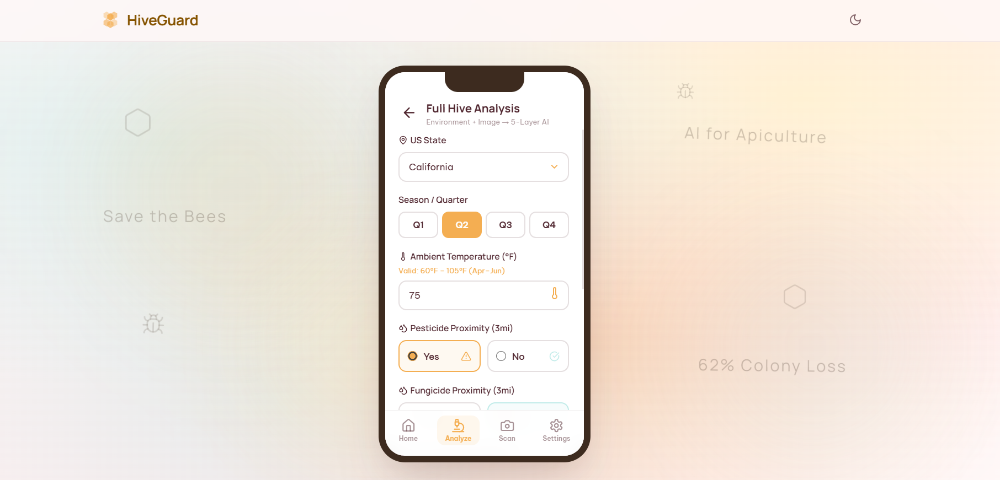
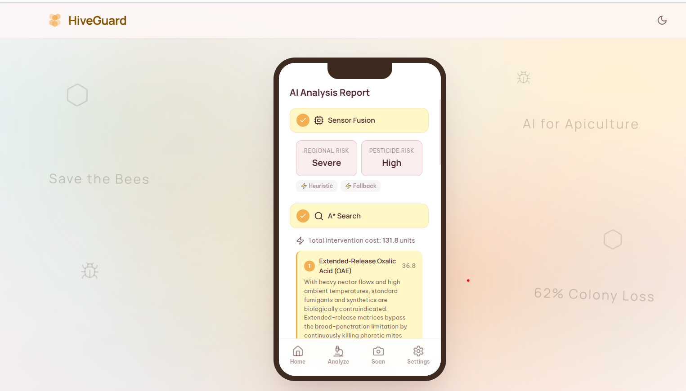
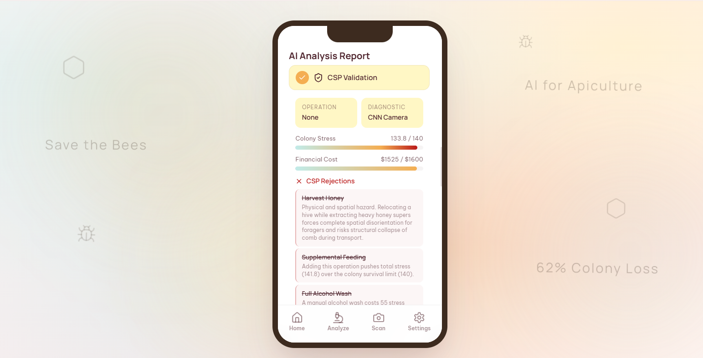
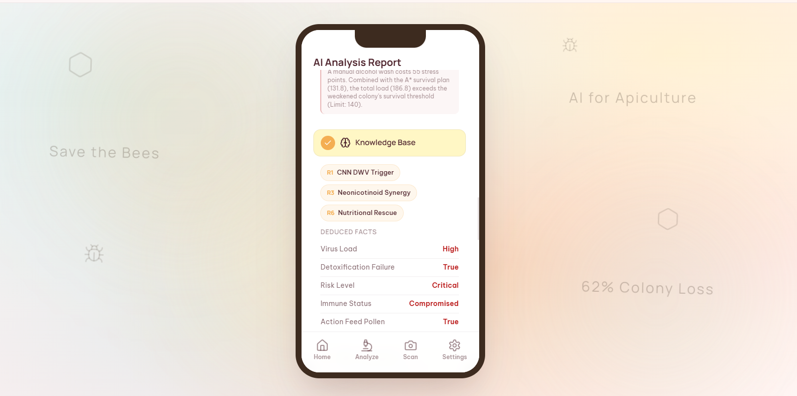
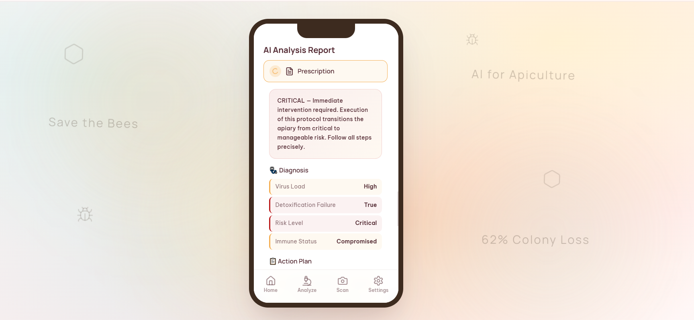
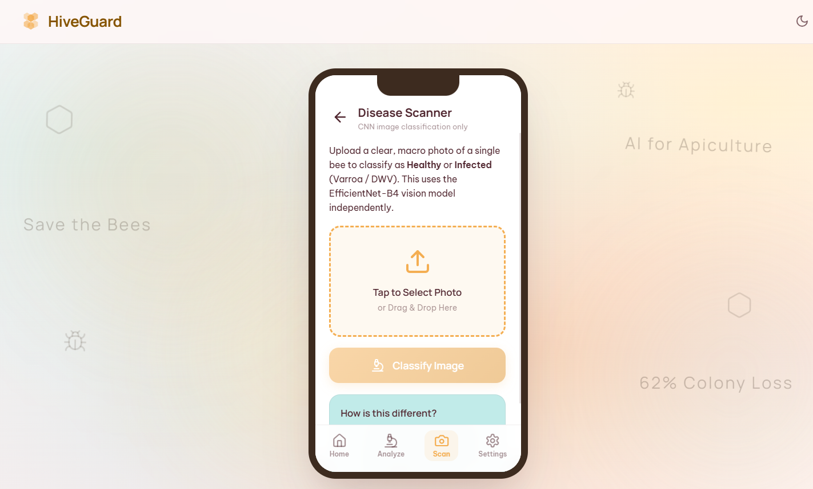
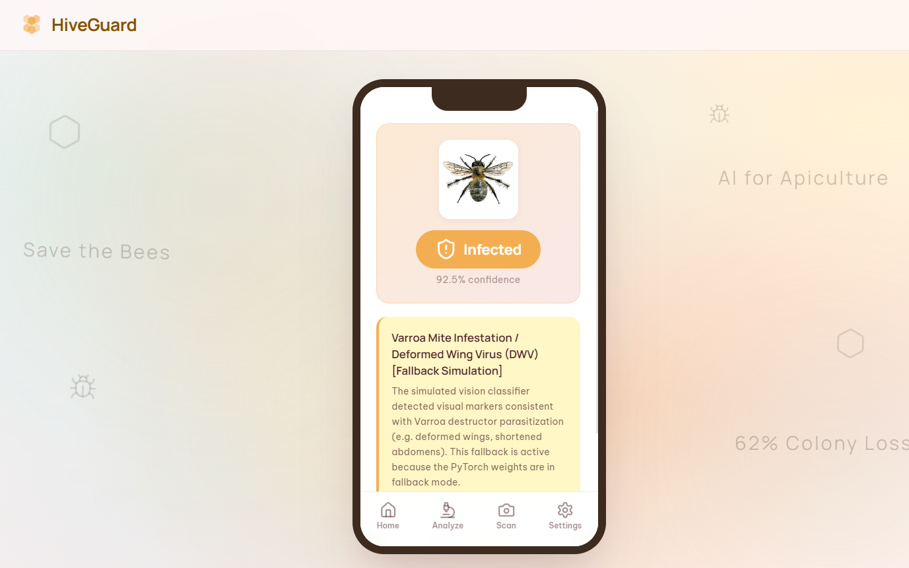

# 🐝 HiveGuard — AI-Powered Beehive Health & Colony Collapse Prevention System

[](https://fastapi.tiangolo.com)
[](https://react.dev)
[](https://pytorch.org)
[](https://scikit-learn.org)
[](https://vitejs.dev)
[](LICENSE)

**HiveGuard** is a full-stack, recruiter-friendly apiculture monitoring and prediction platform. It leverages a state-of-the-art **5-Layer AI Pipeline** to diagnose beehive colony health and formulate optimal intervention plans. By fusing macro-visual analysis (CNNs) with environmental parameters (tabular machine learning), HiveGuard protects apiaries against Varroa destructor infestations, toxic synergy events, and colony collapse.

The user interface features a responsive mobile emulator floating on a glassmorphic web dashboard backdrop.

---

## ⚙️ The 5-Layer AI Pipeline

At the heart of HiveGuard is a sequential, multi-model decision system that combines predictive machine learning, algorithmic search, constraint satisfaction, and expert logic:



### Detailed Layer Breakdown
1. **Layer 1: Sensor Fusion (CNN + TabPFN)**:
   - **CNN Classifier (EfficientNet-B4)**: Analyzes macro bee photos for Varroa mites, Deformed Wing Virus (DWV), or K-Wing wing deformities.
   - **TabPFN Stacking Ensemble**: Processes environmental factors (US state, season, temperature, pesticide/fungicide proximity) to compute regional baseline risk.
   - Both streams are blended into a unified starting state vector.
2. **Layer 2: A\* Search Agent**:
   - Searches the state space of beekeeper interventions (Oxalic vaporization, Thymol, Amitraz, syrup feeding, colony relocation).
   - Dynamically calculates the optimal path that transitions a high-risk colony to safety with the lowest total treatment cost.
3. **Layer 3: Constraint Satisfaction Problem (CSP) Solver**:
   - Validates treatment scheduling constraints. For example, it prevents *Formic Acid* application in high heat or *Thymol* when honey supers are installed.
   - Enforces strict budgets on colony stress score thresholds and financial costs, selecting viable companion operations like honey harvesting.
4. **Layer 4: Biological Knowledge Base (Expert System)**:
   - A forward-chaining inference engine executing 12 expert bio-rules.
   - Identifies complex ecological threats, such as **Lethal Synergy** (where Varroa mite damage destroys the bee's fat bodies, disabling its ability to detoxify nearby agricultural sprays).
5. **Layer 5: Beekeeper Prescription Generator**:
   - Integrates diagnostics (e.g. Alcohol Wash), operations (e.g. Honey Harvest), and chemical treatments into a detailed, prioritised clinical checklist complete with cost, expected efficacy, and safety alerts.

---

## 🛠️ Technology Stack

| Component | Technology | Description |
| :--- | :--- | :--- |
| **Frontend Framework** | React 19 + Vite | Component-driven UI, state management |
| **Styling** | Vanilla CSS | Premium glassmorphic background & mobile UI emulator |
| **Icons** | Lucide React | Modern vector interface iconography |
| **Backend API** | FastAPI | Async REST API endpoints with auto CORS mapping |
| **Deep Learning** | PyTorch + timm | EfficientNet-B4 macro bee classification |
| **Tabular AI** | Scikit-Learn + Joblib | TabPFN stacking classifier and data standardisation |
| **Logic & Solver** | Python 3 | Custom A* pathfinder and Backtracking CSP Solver |

---

## 📂 Folder Structure

```hl
HiveGuard/
├── assets/             # Screenshot assets for documentation
├── backend/            # FastAPI backend server
│   ├── models/         # Trained model weights (EfficientNet, TabPFN)
│   ├── app.py          # FastAPI application & endpoint routing
│   ├── sensor_fusion.py# ML classifier loader and fallback engine
│   ├── a_star_agent.py # A* search algorithm & transition logic
│   ├── csp_solver.py   # Backtracking Constraint Satisfaction Solver
│   ├── knowledge_base.py# Forward-chaining expert rules & facts
│   └── prescription.py # Clinical beekeeper action plan formatter
├── research/           # Jupyter notebooks and raw ML logic explanations
├── public/             # Static public assets (Vite)
├── src/                # React frontend application
│   ├── components/     # App modules & screen layout templates
│   │   └── app/        # Dashboard, Form, Scan, and Results pages
│   ├── context/        # React global AppContext state store
│   ├── App.jsx         # App router and container skeleton
│   ├── main.jsx        # React DOM entry point
│   └── index.css       # Global layout & custom styling variables
├── package.json        # Node.js build configs
├── vite.config.js      # Vite bundler parameters
└── .gitignore          # Repository version control ignores
```

---

## 🚀 Installation & Running Guide

### Prerequisites
* **Node.js** (v18 or higher)
* **Python** (v3.9 to v3.14 recommended)

---

### Step 1: Set up the Python Backend

1. Navigate to the `backend/` folder:
   ```bash
   cd backend
   ```

2. Create a virtual environment and activate it:
   - **Windows (CMD/PowerShell)**:
     ```powershell
     python -m venv venv
     .\venv\Scripts\activate
     ```
   - **macOS/Linux**:
     ```bash
     python3 -m venv venv
     source venv/bin/activate
     ```

3. Install the dependencies:
   ```bash
   pip install -r requirements.txt
   ```

4. Start the FastAPI development server:
   ```bash
   python -m uvicorn app:app --host 127.0.0.1 --port 8000 --reload
   ```
   *The API server will run at `http://127.0.0.1:8000`.*

> [!NOTE]
> If PyTorch or Scikit-learn is not installed or version-mismatched, the backend is built with a **robust fallback heuristic system** that will automatically run the pipeline using rule-based calculations so you can test the UI fully without complex ML environment setup!

---

### Step 2: Set up the React Frontend

1. Return to the root folder (where `package.json` is located):
   ```bash
   cd ..
   ```

2. Install Node modules:
   ```bash
   npm install
   ```

3. Run the development server:
   ```bash
   npm run dev
   ```
   *Open `http://localhost:5173/` in your browser to view the application.*

---

## 📸 Application Screenshot Tour

Here is a visual walk-through of the application screens:

### 📱 1. Beekeeping Dashboard & Emulator (Light / Dark Mode)
The landing portal features a glassmorphic dashboard backdrop with floating honeybee elements and a central mobile phone container. It includes a connection-status health monitor indicating API connectivity, and a toggle to swap between dark and light themes.

<table align="center">
  <tr>
    <td align="center"><b>☀️ Light Mode Dashboard</b></td>
    <td align="center"><b>🌙 Dark Mode Dashboard</b></td>
  </tr>
  <tr>
    <td></td>
    <td></td>
  </tr>
</table>

---

### 📝 2. Full Hive Analysis Form
Collects vital environmental factors (US state, season, local temperature, pesticide/fungicide proximity, apiary profile size). It queries the backend to fetch regional average climate limits, validating parameters inside allowable biological thresholds.

<p align="center">
  
</p>

---

### 🔬 3. 5-Layer AI Pipeline Results
When the form is submitted, the UI runs an interactive step-by-step progress animation visualizing the sequential processing of the layers.

#### Layer 1 & 2: Sensor Fusion & A* Search Agent
Calculates the combined environmental risk and explores optimal intervention pathways, listing treatments and why others were rejected.

<p align="center">
  
</p>

#### Layer 3: Constraint Satisfaction Validation (CSP)
Evaluates constraints such as colony stress ratings and financial budgets, scheduling the appropriate operational and diagnostic actions.

<p align="center">
  
</p>

#### Layer 4: Expert Knowledge Base Facts
Applies forward-chaining rules, deducing additional biological risks like pesticide-mite synergy alerts.

<p align="center">
  
</p>

#### Layer 5: final Beekeeper Clinical Prescription
Outputs the prioritized Action Plan checklist indicating specific instructions, effort costs, and expected efficacy.

<p align="center">
  
</p>

---

### 📷 4. Standalone CNN Disease Scanner
For quick visual testing, the standalone scanner allows uploading a macro photo of a single honeybee specimen. The CNN model classifies the sample as **Healthy** or **Infected**, returning confidence levels and a detailed morphology description.

<table align="center">
  <tr>
    <td align="center"><b>Visual Upload Zone</b></td>
    <td align="center"><b>Neural Classification Results</b></td>
  </tr>
  <tr>
    <td></td>
    <td></td>
  </tr>
</table>

---

## 🔮 Future Improvements

- **Real-Time IoT Telemetry**: Connect physical telemetry scales and internal hive thermometers to feed real-time sensor streams into the tabular solver.
- **Edge Deployment**: Compress the CNN classifier (EfficientNet-B4) using Quantization-Aware Training (QAT) to run offline directly on rural mobile units.
- **Extended Diagnostics**: Expand the knowledge base and CNN multi-class capabilities to scan for American Foulbrood, Chalkbrood, and Nosema diseases.

---

## 📝 License

Distributed under the **MIT License**. See [LICENSE](LICENSE) for details.

---
